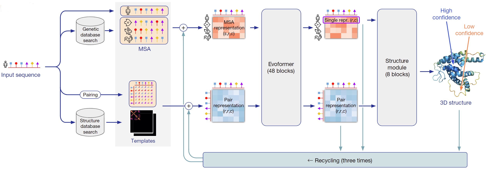
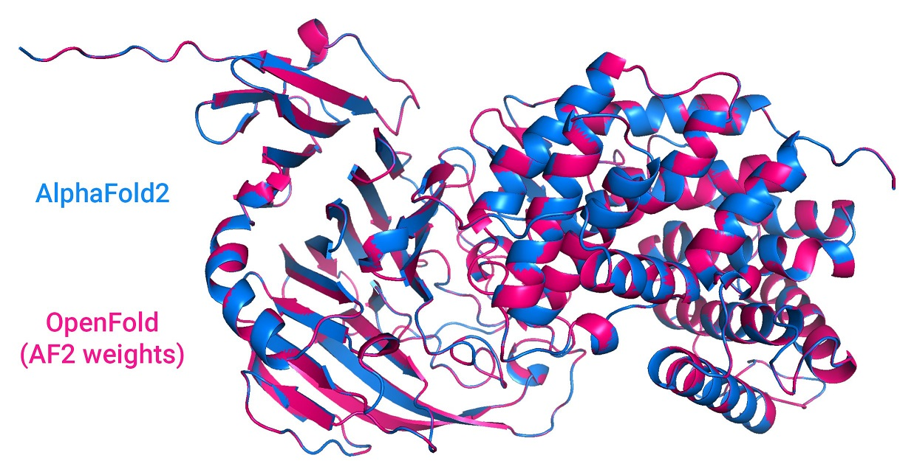

# Alphafold Optimized

简体中文 | [English](README_en.md)



本项目实现了一个性能优化版的Alphafold，大幅加速了Alphafold模型的训练。基于[Openfold](https://github.com/aqlaboratory/openfold)实现的Pytorch版Alphafold进行优化，通过对数据处理、读取的优化以及hfai.nn提供的算子优化提升了模型的整体训练性能。

## 使用方式

### 环境要求

    python>=3.8
    pip install -r requirements.txt

### 数据预处理
Alphafold Optimized使用的是已经预处理后的数据集，可以从OSS下载。

### 模型训练

Alphafold模型的训练对显存的要求较高，至少需要22GB的GPU显存进行训练。

提交任务至萤火集群：

```shell
hfai python run_train.py -- -n 16 -p 30
```

本地运行：

```shell
source hfai_env openfold38
python train_fold.py \
./data/processed_data/pdb_mmcif_processed \
./data/processed_data/alignments \
./data/pdb_mmcif/ \
output 2021-10-10 \
--template_release_dates_cache_path ./data/mmcif_cache.json \
--precision 32 --gpus 1 --num_nodes 1 --seed 41 \
--train_mapping_path ./data/data_mapping.json --use_hfai
```

### 模型推理

```shell
source hfai_env openfold38
python run_pretrained_openfold.py example_data/fasta/1ak0_1_A.fasta \
    data/uniref90/uniref90.fasta \
    data/mgnify/mgy_clusters_2018_12.fa \
    data/pdb70/pdb70 \
    data/pdb_mmcif/ \
    data/uniclust30/uniclust30_2018_08/uniclust30_2018_08 \
    --output_dir ./ \
    --bfd_database_path data/bfd/bfd_metaclust_clu_complete_id30_c90_final_seq.sorted_opt \
    --model_device cuda:1 \
    --jackhmmer_binary_path ./bin/jackhmmer \
    --hhblits_binary_path ./bin/hhblits \
    --hhsearch_binary_path ./bin/hhsearch \
    --kalign_binary_path ./bin/kalign
```

## 样例



## 参考

[Deepmind's Alphafold](https://github.com/deepmind/alphafold)

[Openfold](https://github.com/aqlaboratory/openfold)

## 引用

```bibtex
@software{Ahdritz_OpenFold_2021,
  author = {Ahdritz, Gustaf and Bouatta, Nazim and Kadyan, Sachin and Xia, Qinghui and Gerecke, William and AlQuraishi, Mohammed},
  doi = {10.5281/zenodo.5709539},
  month = {11},
  title = {{OpenFold}},
  url = {https://github.com/aqlaboratory/openfold},
  year = {2021}
}
```

引用Openfold的工作同时需要引用Deepmind Alphafold.