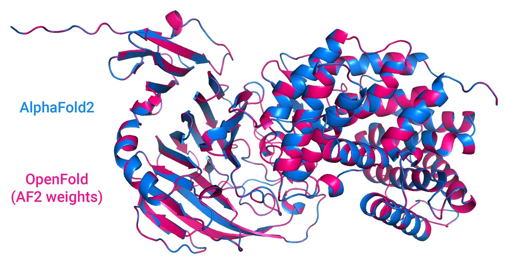

# Alphafold Optimized

English | [简体中文](README.md)


In this project, we optimized the training speed of Alphafold. The model is built upon [Openfold](https://github.com/aqlaboratory/openfold)'s pytorch version of Alphafold, and we speed up training by optimizing data processing, data loading, and CUDA operator optimization provided by hfai.nn module. 


## Usage

### Requirements

    python>=3.8
    pip install -r requirements.txt

### Data Preprocessing

Alphafold Optimized uses the preprocessed dataset which can be downloaded from OSS.

### Model Training

Training Alphafold requires at least 22GB of GPU memory.

Run the model with high-flyer's yinghuo AI-HPC:

```shell
hfai python run_train.py -- -n 16 -p 30
```

Run training locally:

```shell
source hfai_env openfold38
python train_fold.py ./data/processed_data/pdb_mmcif_processed ./data/processed_data/alignments ./data/pdb_mmcif/ output 2021-10-10 --template_release_dates_cache_path ./data/mmcif_cache.json --precision 32 --gpus 1 --num_nodes 1 --seed 41 --train_mapping_path ./data/data_mapping.json --use_hfai
```

### Model Inference

```shell
source hfai_env openfold38
python run_pretrained_openfold.py example_data/fasta/1ak0_1_A.fasta \
    data/uniref90/uniref90.fasta \
    data/mgnify/mgy_clusters_2018_12.fa \
    data/pdb70/pdb70 \
    data/pdb_mmcif/ \
    data/uniclust30/uniclust30_2018_08/uniclust30_2018_08 \
    --output_dir ./ \
    --bfd_database_path data/bfd/bfd_metaclust_clu_complete_id30_c90_final_seq.sorted_opt \
    --model_device cuda:1 \
    --jackhmmer_binary_path /ceph-jd/pub/marsV2/lib/conda/envs/openfold_venv/bin/jackhmmer \
    --hhblits_binary_path /ceph-jd/pub/marsV2/lib/conda/envs/openfold_venv/bin/hhblits \
    --hhsearch_binary_path /ceph-jd/pub/marsV2/lib/conda/envs/openfold_venv/bin/hhsearch \
    --kalign_binary_path /ceph-jd/pub/marsV2/lib/conda/envs/openfold_venv/bin/kalign

```

## Sample



## Reference

[Deepmind's Alphafold](https://github.com/deepmind/alphafold)

[Openfold](https://github.com/aqlaboratory/openfold)

## Citation

```bibtex
@software{Ahdritz_OpenFold_2021,
  author = {Ahdritz, Gustaf and Bouatta, Nazim and Kadyan, Sachin and Xia, Qinghui and Gerecke, William and AlQuraishi, Mohammed},
  doi = {10.5281/zenodo.5709539},
  month = {11},
  title = {{OpenFold}},
  url = {https://github.com/aqlaboratory/openfold},
  year = {2021}
}
```

Any work that cites OpenFold should also cite AlphaFold.