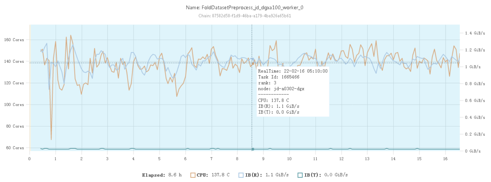
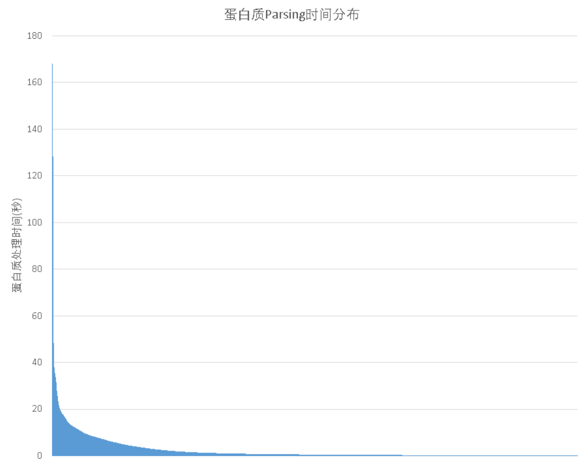
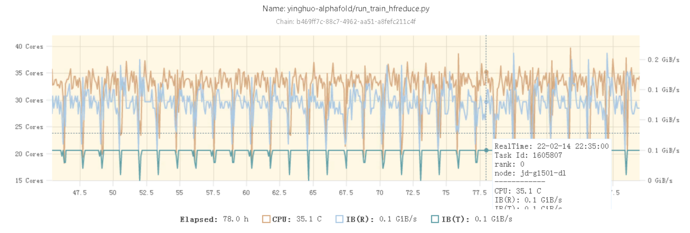

# Alphafold 2 优化总结

##  介绍

若说2021年人工智能学术界最令人振奋的成果，那么Alphafold 2可谓当之无愧。Alphafold 2在CASP14蛋白质预测挑战上取得了远远超出同类模型的准确率，并首次将蛋白质结构预测的精度提高到了原子级别——已经接近了实验测量的水准。

出于对于如此重要的成果的关心，我们在Alphafold 2推出后不久就尝试在幻方萤火二号平台上进行了yinghuo-Alphafold 2的训练尝试，成功的在幻方AI平台上将Alphafold 2的训练运行了起来。只是由于Alphafold 2对CPU算力的高依赖和模型本身极高的复杂性，开源的模型代码本身存在很多的缺陷；并且幻方萤火平台的架构也有一定特殊性，使得在幻方AI平台上直接复现Alphafold 2的训练会产生巨大的资源浪费，难以在高效利用资源和控制成本的前提下完成训练。

为了真正完整的在幻方平台实现Alphafold 2的预训练，探索这样一个具有代表性的深度学习模型在幻方AI平台的性能极限，我们对Alphafold 2模型进行了大量优化，大幅提高了模型训练的效率，并在部分数据上成功复现了整个训练过程。总的来说，我们对Alphafold模型的改造工作可以被概括为这样三点：

1. 在幻方AI平台基于DDP实现了高效的Alphafold 2训练，大大简化了后续复现的难度
2. 通过对数据处理读取的优化，输入特征的优化以及All Reduce优化将训练时GPU利用率从40%左右提升到了90%以上 
3. 解决了开源版本中无法多卡训练和数据处理效率低下的问题；解决了在幻方环境hfai_env无法多机训练的问题

## 优化方法

### 基本逻辑

由于朴素的Alphafold 2模型复杂性和幻方AI平台的架构特殊性，其在幻方萤火平台上直接的训练效率非常低下：在无优化模型使用上单卡训练时也仅仅能达到40%的GPU利用率，而在使用多卡并行训练时由于通讯等额外开销，利用率就会进一步降低，在训练效率上有相当大的优化空间。但对Alphafold 2进行优化的基本逻辑其实和一般的模型无二：从GPU利用率入手了解模型整体的训练效率，再根据模型在训练各个阶段的耗时情况，来分析可能的优化空间。一个DL模型训练时的耗时主要有这样几个部分：前向传播，反向传播，以及数据读入和处理。其中，反向传播还包括了并行训练时的梯度传递开销。在不修改模型结构或进行算子级优化的基础上，前向传播和反向传播的GPU计算耗时很难通过什么优化方式大幅减少。因此，训练优化的重点目标就放在了对反向传播中的梯度传递，以及数据读入和处理两个方向进行优化上。

Alphafold 2模型也服从这样的逻辑：在训练时低下的GPU利用率无非时因为GPU在等待训练数据被处理完成，或是在等待从其他GPU获取梯度（在Pytoch DDP框架下，等待梯度同步时GPU会在`nvidia-smi`中显示出很高的利用率，但从功耗情况可知其真实利用率极低）。观察训练时每次迭代的运行时间和GPU利用率的变化情况，我们发现Alphafold 2的瓶颈主要在于数据处理耗时。Alphafold 2的特征处理对CPU性能要求很高，耗时很长，尤其是在大batch_size的情况下：所有GPU都需要等待最慢的那一个GPU上的数据处理，运算完同步梯度。另外与其他模型相比，Alphafold 2的特殊性体现在即使在并行GPU数量较大时，梯度同步开销也远小于其他部分的开销：模型具有“参数量小，运算量大”的特点，只有很少的梯度需要传输，因此耗时远小于前向和反向传播的开销。

根据上述对模型特点的分析，我们的优化方向也主要放在了对Alphafold 2数据处理的部分进行优化。当然，在随后我们也会具体探讨为何其他优化方式在Alphafold 2上获得的收益并不大，尤其是对大多数模型而言开销巨大的梯度传输部分。

### 特征预处理

巨大的CPU性能开销是Alphafold 2模型的一大特点。在一般的机器学习任务中，往往模型训练耗时的大头都在于GPU的前向推理和反向传播的计算，少量的数据处理很容易通过使用异步Dataloader载入的方式来掩盖其时间开销。然而在Alphafold 2的训练中，模型对处理好的数据进行一次迭代只需要大约11秒（基于A100 GPU），而对于这一个数据的预处理则需要花费大约 2.5核*时。即使使用萤火集群上每个节点的一整颗EPYC 64核处理器也需要150秒，是GPU运算时间的约13倍，根本无法被GPU计算隐藏。在这种情况下，GPU利用率的理论上限也仅有7.3%，效率是非常低下的。

考虑到每个机器有8台GPU而只有一颗CPU，训练期间CPU资源的紧缺更使得运行时优化特征预处理已经是毫无意义的了。又由于这些特征只需要被预处理一次就可以在每个epoch训练时直接读入，因此我们选择将特征预处理单独分离出来，使用集群CPU算力完成这一部分。Deepmind的官方代码实现中提供了一版特征预处理的实现，其中对每个数据线性的进行预处理，并且处理过程依赖生物学工具，因此效率依然较低。

为了提高数据预处理过程的效率，最大化CPU利用率，我们使用Python多进程对特征预处理部分进行了并行化。但由于这个过程中涉及到多个不同的生物学工具，且每种工具对CPU的利用效率不同，因此朴素的并行化很容易导致进程过多，从而产生大量的CPU调度抢占开销。根据统计，在对几个不同类型的特征进行处理时的CPU资源占用情况如下表：（基于64核CPU节点测得）

| 蛋白质数据集 | 处理工具  | 耗时   | CPU占用核数 | 总算力需求(秒/CPU核) |
| ------------ | --------- | ------ | ----------- | -------------------- |
| Uniref90     | JackHmmer | 567(s) | 4核         | 2268                 |
| Magnify      | JackHmmer | 851(s) | 4核         | 3420                 |
| Bfd-small    | JackHmmer | 308(s) | 4核         | 1224                 |
| Pdb70        | HHSearch  | 62(s)  | 64核        | 3960                 |

因此需要针对不同的处理工具建立不同的进程池进行调度分配。可以观察到对于前三个数据集的Query使用的是相同的工具JackHmmer，其基本只能使用4核的CPU资源；而对Pdb70的处理则需要使用HHSearch：其能够使用CPU上的所有资源。因此一个比较基本的优化策略就是同时发起多个JackHmmer任务，并每隔一段时间发起一个HHSearch任务（其处理时间远少于JackHmmer）。在128核CPU的节点上，经过优化后的预处理时的CPU占用率见下图。可见此时已经可以基本以比较稳定的100%利用率使用CPU资源。

### 数据读取

#### FFRecord

FFRecord一般来说能够帮助模型在进行Batch读取时将单个数据点的小文件读取转为大块的连续读取，从而减少IO开销。但在Alphafold 2模型中由于模型前向传播的路径很长，在模型参数只有92M的前提下单个数据就能够占用21GB显存，因此每个GPU上的batch_size也只能设置为1。在这种情况下很难使用FFRecord提供的Batch连续读取，因此FFRecord能够帮助我们在Alphafold 2的训练中减少的IO开销也比较有限。当然为了后续使用的方便，在Alphafold 2的训练中我们依然使用了FFRecord来管理我们的训练数据。

### 数据处理

#### 蛋白质Parsing缓存

在Alphafold 2的训练中，任何所有的输入蛋白质都需要经过Parsing的过程来提取蛋白质的序列信息，空间结构信息等等。这个过程花费的时间从数秒到数百秒不等，而几乎所有特征中又都包括了蛋白质特征，因此Parsing过程占据了整个Alphafold 2训练时特征大部分的预处理开销。

由于Pytorch Dataloader的worker本身是守护进程，因此无法通过多进程来加速可并行的特征预处理。况且一个节点上的8张显卡每张卡都需要8个Dataloader进程，总数已经达到了节点上的CPU核心数，很难通过并行化压榨CPU算力来进一步缩减运行时的数据处理耗时。因此，在这里我们使用了用空间换时间的策略：尝试使用缓存已经被处理完的数据（例如经过Parsing后的蛋白质序列数据）的方式来减少这一部分的耗时。

通过Python的Pickle包，我们能够将处理后的结果蛋白质信息直接打包存储到硬盘中，在下一次遇到相同蛋白质时可以直接读取缓存在其中的信息。虽然因此需要付出额外的磁盘开销，需要比存储原蛋白质的`.mmcif`多一倍的空间占用，但节省的时间开销可以让我们在后续的特征裁切时更加从容，尽量的保证模型的训练精度。通过这个方法能够获得比较明显的加速效果：读取Pickle打包缓存的数据在耗时上只需要正常处理的约$\frac{1}{3}$的时间。

### 特征裁切

对特征处理的优化并不足以使得Alphafold 2能够在集群上流畅的进行训练。因此我们还需要在模型训练精度和训练时间间做出权衡，对特征进行一定的裁切处理来保证模型能够在高GPU利用率下完成训练。Alphafold 2的输入特征可以分为这样三类：

1. 蛋白质本身的氨基酸序列
2. Multi-Sequence Alignment(MSA)多序列对齐特征
3. Template蛋白质模板特征

其中每一个特征在不同蛋白质序列间的长度差异都非常大，因此处理需要花费的时间差异也很大，跨度可以从几秒到上千秒不等，会极大的影响模型训练的效率。例如在一次20分钟的训练过程中，单个样本的处理就能阻塞整体训练10几分钟。而在多卡大batchsize场景下，每个batch内有部分数据的处理时间极长几乎成了必然事件。为了避免训练被阻塞，可以考虑将这一部分特征的运行时处理转为预处理，或是对较长的特征进行裁切。但由于每轮训练时输入特征本来就要经过随机选取，因此只能在运行时进行处理。另外进行特征裁切必然会影响模型训练效果，因此需要在模型性能和训练效率二者间trade-off。

在上述三类特征中，由于蛋白质序列本身无法被裁切（裁切后就与原蛋白质完全不同），且处理所需时长远小于另外两类特征，因此在这里不做考虑。

#### MSA特征裁切

MSA特征是一组与输入的人类蛋白质序列相似的其他生物蛋白质序列的集合，用于帮助模型Encoder部分形成蛋白质的特征向量。若输入的蛋白质序列长度为$N_{res}$个氨基酸，在预处理阶段中找到的同源蛋白质数量为$N_{msa}$，则需要进行预处理的MSA特征的大小就为：$N_{res} \times N_{msa}$。可见在蛋白质序列不能被裁切的前提下，只能通过对同源蛋白质的$N_{msa}$维度进行裁切，即丢弃部分之前查找到的同源序列来减少这部分的耗时。为了保证所有同源序列都能对模型训练产生影响，在每轮训练时我们会在MSA特征数量超出一个固定的限制时，随机抛弃一部分的序列来控制这一部分的特征处理耗时。

通过计算和统计蛋白质序列长度$N_{res}$，MSA特征序列数$N_{msa}$，和最终处理时长$T$的关系，我们可以基本得出他们三者服从这样的线性关系：
$$
T=C \dotproduct N_{res} \dotproduct N_{msa}
$$
其中$C$为一个固定常数，其值为$1.7\times 10^{-8}$。因此，我们就获得了每次MSA特征处理时长与输入序列中总氨基酸残基数的关系。由于在每次迭代时训练受到整个Batch中最慢的特征处理时间的阻塞，因此我们需要小化最长的特征处理时间。从实验结果可知，在MSA部分150秒的耗时是使得训练不被阻塞的最大时长。因此我们就可以根据上面的公式推得每个输入蛋白质序列的最大MSA特征量。而在所有的蛋白质中，只有不到10%的序列需要被裁切MSA特征，但能够大幅度减少训练被阻塞的情况，因此这能够在不损害性能的情况下极大的提升训练的效率。

#### Template特征裁切

模板特征是与要预测的输入蛋白质在空间结构上相似的蛋白质序列，用于帮助模型的Structure Module部分根据输入的蛋白质特征向量，输出蛋白质的空间结构。同样地，单个蛋白质可能有上百个模板，虽然在Alphafold 2的训练中最终只有4个模板需要被送入模型参与训练，但未必所有模板都与蛋白质真正匹配。因此一旦遇到大量模板都不符合要求的情况，在检查模板序列的过程中就可能要花费十几分钟的时间。

对于Template特征的处理在运算上可以进行并行化，但受限于前述的Pytorch Dataloader守护进程的问题和CPU资源量的限制，很难在实际训练中通过并行化的方式加速模板特征的处理。因此我们同样需要考虑对模板特征进行裁切来减少在这里消耗的时间。对于待处理的模板，首先会按照预处理时得到的匹配度进行排序 ，尽量使用与原蛋白质更匹配的模板。另外对于模板匹配过程设有一个固定的时间限制$T_{template}$（实践中设置为150秒），为一个蛋白质匹配模板的最长时间。

### DDP Backend：NCCL -> HFReduce

由于幻方萤火二号架构的特点，Nvidia官方提供的NCCL并不能充分发挥集群的通信带宽，因此使用自研的HFReduce也能够在模型训练中减少梯度同步时需要等待显卡间通信的时间。虽然由于Alphafold 2模型本身的特点是前向传播通路较长，而反向传播路径较短，但通信开销依然是训练过程中不可忽略的一部分。因此我们也为Alphafold 2的训练过程引入了HFReduce，希望借此将Alphafold 2在集群上的计算效率推向极致。但在实践中我们却发现HFReduce给Alphafold 2训练带来的收益微乎其微，这可能是因为Alphafold 2特殊的模型结构所导致的，我们将在随后的实验部分从实验结果出发来分析这一问题。

## 实验

在这一部分记录了整个优化过程中的实验结果。在所有实验中，都使用了基本相同的数据和完全相同的随机种子41。

### 训练优化效果

首先考虑在Alphafold 2模型在单张GPU上进行训练时一个Step的开销：

| Stage                      | Mean duration(s) | Percentage(%) |
| -------------------------- | ---------------- | ------------- |
| Training Step              | 12.65            | 100           |
| Backward                   | 5.93             | 46.88         |
| Forward                    | 4.24             | 33.52         |
| Get Training Batch         | 1.87             | 14.78         |
| Optimizer Step             | 0.45             | 3.42          |
| Zero Grad                  | 0.17             | 1.31          |
| Exponential Moving Average | 0.14             | 1.0           |

从表格中可以看到，一次单步的Training Step就要花费12.65秒，可见在单个Epoch的训练中，最主要的时间开销在于Backward，Forward和Get Training Batch三步。由于使用的数据很少，并且没有使用多卡并行，此时特征处理带来的性能瓶颈和DDP的开销还没有能体现出来。

而当训练数据较多时，不同训练数据间的处理时间差异就会显得尤为突出。从下图中可见大多数的输入数据只需要数秒即可完成处理，然而少部分蛋白质在极端情况下会需要上百秒的预处理时间。

因此一旦遇到一条这样的输入数据，就会导致整个训练阻塞。而假设所有训练数据中只有5%会导致训练阻塞，那么在使用128的batch_size训练Alphafold 2（原论文参数）时，每个batch被阻塞的概率就为: 
$$
P_{stuck}=1-(1-0.05)^{128}=99.86\%
$$
即几乎在每个step的训练中都会遇到阻塞的情况。此时整个训练的GPU利用率会很极端的下滑到20%以下，其中大部分时间都花费在了等待batch中的某一个数据处理完成上。

例如在没有进行优化时使用16个节点，128张A100进行训练，那么前4个step的花费时间就为：413s, 177s, 100s, 101s, 每个step中的GPU利用率不到10%。可见此时若是不对数据处理进行优化，那么很难正常进行训练。

#### 蛋白质Parsing缓存

我们在总共11万条的蛋白质序列训练数据中，随机抽取了3.5万条蛋白质序列进行解析，并统计了这些序列分别使用直接解析和读取Cache方式的耗时：

对于处理时长大于10秒的序列，读取解析Cache的平均时长只有直接进行解析的时长的35.3%，原来需要150秒的特征解析在优化后仅仅需要50秒左右，大大抑制了超长序列对整个训练的阻塞影响。例如对于几个典型的处理时间较长的蛋白质，使用Parsing Cache能带来的提升如下：

| 蛋白质ID | 原处理时间 | 使用Parsing缓存后的时间(除以原处理时间) |
| -------- | ---------- | --------------------------------------- |
| 3j3q     | 145.9      | 29.2%                                   |
| 3j3y     | 129.8      | 31.6%                                   |
| 6u42     | 78,9       | 34.9%                                   |

对于使用Parsing Cache和不使用时在真实训练中的作用，我们进行了以下实验来测试使用Parsing Cache对训练时的GPU利用率和总训练时间能带来多大的收益。实验使用以下Setting：

> 总GPU数量：128个
>
> 训练数据量：73408条蛋白质
>
> batch_size：1
>
> 总训练轮数：1
>
> 是否使用MSA特征裁切：是
>
> 是否使用Template特征裁切：否
>
> DDP Backend：HFReduce

其中由于Template特征裁切基于的是总时长进行操作，因此需要暂时不使用这部分优化来体现Parsing时长变化对训练时长的影响。实验的结果如下：

|                          | 不使用Parsing Cache | 使用Parsing Cache |
| ------------------------ | ------------------- | ----------------- |
| 每轮开始时的数据处理时长 | 451(s)              | 393(s)            |
| 平均每个step时长         | 50.3(s)             | 23.57(s)          |
| 训练被阻塞次数           | 6                   | 10                |
| GPU利用率                | 19.58%              | **42.37%**        |

可见在使用缓存时，能够获得非常明显的收益，GPU利用率能够获得20%以上的提升。但即便如此由于频繁的被打断训练，整体的GPU利用率依然不足一半，因此我们仍然需要进行后续的特征裁切优化。

#### MSA特征裁切

在这里我们对于是否使用MSA特征裁切下，模型的训练进行了对比。

实验setting如下：

> MSA特征裁切的时间常数C：2e-6
>
> 总GPU数量：128个
>
> 训练数据量：73408条蛋白质
>
> batch_size：1
>
> 总训练轮数：1
>
> 是否使用Template特征裁切：是
>
> 是否使用Parsing Cache：是
>
> DDP Backend：HFReduce

|                          | 不进行MSA裁切 | 裁切MSA特征 |
| ------------------------ | ------------- | ----------- |
| 每轮开始时的数据处理时长 | 219(s)        | 200(s)      |
| 平均每个step时长         | 21.98(s)      | 10.87(s)    |
| 训练被阻塞的次数         | 6             | 1           |
| GPU利用率                | 34.77%        | **90.2%**   |

使用MSA特征裁切后GPU利用率能够提升200%以上，可见能够有效提升训练效率。

#### Template特征裁切

在这里我们对于是否使用Template特征裁切时，模型的训练进行了对比。

实验setting如下：

> Template特征裁切的时间限制：150秒
>
> 总GPU数量：128个
>
> 训练数据量：73408条蛋白质
>
> batch_size：1
>
> 总训练轮数：1
>
> 是否使用MSA特征裁切：是
>
> 是否使用Parsing Cache：是
>
> DDP Backend：HFReduce

|                          | 不进行Template裁切 | 裁切Template特征 |
| ------------------------ | ------------------ | ---------------- |
| 每轮开始时的数据处理时长 | 451(s)             | 200(s)           |
| 平均每个step时长         | 18.7(s)            | 10.87(s)         |
| 训练被阻塞的次数         | 10                 | 1                |
| GPU利用率                | 42.37%             | **90.2%**        |

使用Template特征裁切后GPU利用率同样能够提升一倍以上。

#### HFReduce

在这部分的结果中，NCCL的结果使用Pytorch标准DDP测得；HFReduce的结果使用hfai_DDP测得。结果如下：

|                  | NCCL     | HFReduce |
| ---------------- | -------- | -------- |
| 每个step平均时长 | 11.27(s) | 11.26(s) |
| 梯度同步耗时     | \        | 0.48(s)  |
| 训练数据量       | 73472    | 73472    |
| 总step数         | 574      | 574      |
| GPU数            | 128      | 128      |
| batch_size       | 1        | 1        |

从实验结果来看，可以认为在Alphafold 2的训练场景下HFReduce和NCCL的不同选择并不会带来显著的效率差异。理论上来说，HFReduce比NCCL更加适合萤火二号的集群架构，一定能带来比DDP更快速的梯度同步。但在Alphafold 2的实验结果中，两次实验中每个Step的迭代速度几乎完全相同。接下来我们将在理论上对这种实验结果和预期的差异做出一些分析。

首先需要指出的是，”梯度同步耗时“测算的是一个完整Epoch中，一个进程上每次迭代中`model.symc_grad()`函数从调用到返回的耗时的平均值。由于数据在不同进程间分布的随机性和足够大的数据量，可以认为这个数字对参与训练的所有进程上的梯度同步耗时都有足够的代表性。但即使这样，这个耗时数据却一定会大于真实的All Reduce通信开销，这是因为这个耗时中包括了等待其他进程完成迭代并发送梯度数据的空闲等待时间。估算等待时间的占比在20%左右，那么真实的梯度同步开销就只有0.4秒，占单次迭代时间的3.5%。虽然由于标准DDP封装了这部分操作在backward中难以直接测算，但从两者的平均迭代时长也可以看出Pytorch DDP和HFReduce在Alphafold 2训练上的梯度同步开销差距很小。

对于这种现象，最主要的原因可能是Alphafold 2独特的模型结构和蛋白质数据的特点使得模型虽然需要很大量的GPU运算，却只需要传输很少的梯度数据。Alphafold 2的模型参数量只有$93.2M$，使用$FP32$单精度的情况下占用显存为$372.8\ MB$。模型的参数量不到1亿，还没有BERT-base的参数多。然而在前向传播时Alphafold 2会将模型中的主要部分（Evoformer）复制4次，因此这时就会带来一个很长的前向传播通路，使得时间复杂度大大增加。这时，最终模型需要更新的参数依然只有原先的数量，因此显得梯度同步的开销在整个迭代中显得微不足道了。

#### 总体优化结果

在使用上述优化后，我们进行了比较完整的Alphafold 2训练。实验setting如下：

> 总GPU数：128个
>
> 单机CPU核心数：64个
>
> 训练数据量：57088条蛋白质
>
> batch_size：1
>
> 总训练轮数：80
>
> 是否使用MSA特征裁切：是
>
> 是否使用Template裁切：是
>
> 是否使用Parsing Cache：是
>
> DDP Backend：HFReduce

最终我们得到了如下的实验结果：

| 平均GPU利用率             | 90.14%        |
| ------------------------- | ------------- |
| 平均每Epoch时间           | 84.15(min)    |
| 平均每次迭代时间          | 11.32(s)      |
| 每Epoch开始时数据加载时间 | 197(s)        |
| 总迭代数                  | 35680         |
| 总训练时长                | 4.6天（112h） |

训练时的GPU利用率曲线如下：

训练时的GPU利用率大多数时候在90%左右。可见经过上述的多种优化后，Alphafold 2已经能够在幻方AI平台上高效进行训练，而有中间偶尔出现的利用率骤降则是训练开始时的数据加载耗时。

另外，从CPU利用率图可以看出，整个训练过程中CPU的利用率长期保持在大于50%（35/64核）的情况，说明Alphafold 2训练时确实对CPU算力有非常大的需求。

### Alphafold 2多卡训练中的一些踩坑

在将Alphafold 2模型从单机单卡拓展至多机多卡时，我们遇到了不少的问题。

#### Openfold代码问题

Alphafold 2使用了比较复杂的模型结构，其中不同蛋白质序列数据在训练时可能会有不完全一样的前向传播路径，导致多卡训练时有些机器上会有一部分参数并有参与梯度计算，而Pytorch DDP提供的find_unused_parameters并不能正确的找到这部分参数，因此无法正常进行多卡训练。经检查发现是Loss Function部分中存在部分不参与计算的Loss，需要将其手动Disable掉后能够正常进行多卡训练。

#### hfai_env环境问题

Alphafold 2 本身所依赖的环境与幻方平台上的标准环境有较大出入。我们通过hfai_env完全创建了一个全新的venv，并安装了Alphafold 2依赖项。但却发现在进行多机多卡训练时会出现NCCL Error的问题。经过排查后发现由于自建了全新的环境并创建了与原先不同的全新Python bin文件，而新建的Python并没有获得IPC Lock，因此在多机多卡训练时NCCL会出现问题。需要在sudo权限下使用setcap指令`setcap cap_ipc_lock+iep /venv/openfold38_0/bin/python`解决问题。

## 局限与展望

虽然经过我们的优化后模型本身训练的效率已经很高，GPU利用率达到90%以上，但我们仍然对模型性能做出了一定的取舍，并且模型内部仍然存在不少优化的空间。一方面来说我们已经完成的优化都基于不修改模型内部结构的前提，因此对模型内不同部分的差异造成的额外overhead难以处理；另一方面来说训练时显存的利用还不够理想：A100 40GB的显存只能使用到21GB而有接近一半的空余，但batch_size只能设置为1，造成了大量浪费。从这两个角度入手，后续在Alphafold 2模型上还可以进行的优化有以下三个方向：

1. **结构简化：**Alphafold 2本身虽然达到了很好的蛋白质预测准确率，但其复杂的模型结构和极高的资源占用使得复现和部署模型推理都有很高的门槛。因此，仍然可以考虑对模型内部进行细致的Profile，寻求对模型结构进行一定程度的简化。
2. **算子优化：**幻方AI在算子优化，尤其是Transformer类模型的算子优化方面有很多的积累，而Alphafold 2作为一个同样基于Transformer结构的模型，还没有用到这些算子优化技术。因此，在这里也有进一步优化的空间。
3. **模型并行：**Alphafold 2目前训练时的漩村占用率仍然不高，单卡batch_size也只能设置为1。可以考虑尝试在Alphafold 2上应用更多的模型并行方式，例如和Pipeline结合来增大训练时的单卡batch_size，提升显存使用效率。

## 结论

借助萤火二号HPC的强大算力，我们成功在幻方AI平台上使用128张A100比较完整的复现了Alphafold 2的预训练，并且在此过程中以90%以上的GPU使用率高效的利用了集群资源。一方面来说，作为2021年AI领域最具影响力的工作之一，Alphafold 2的复现无疑是有影响力的。更重要的是考虑到Alphafold 2模型极高的复杂性，能够在幻方AI平台上高效的训练它也能很好的代表平台对于大规模的数据并行训练的有效性，更可以将这种能力使用到训练一般的DL模型上。当然，我们也注意到不仅Alphafold 2模型内部仍有可以发掘的加速空间，并且由于Alphafold 2的特殊性，一些在幻方AI平台上本应能进一步加速训练的工具例如FFRecord，HFReduce并没有能展现出他们应有的性能水平。从这个角度来说，Alphafold 2虽然已经能够在幻方AI平台顺畅的完成训练，但并不能完全体现出一般性的深度学习模型（BERT, LSTM, ResNet）能够在幻方AI平台上获得的加速效果。

